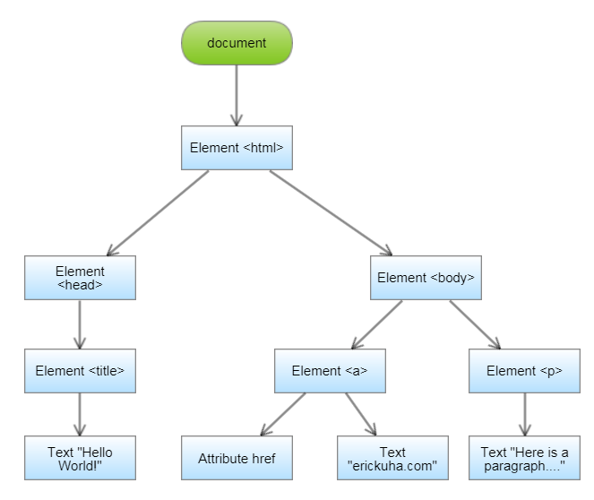

Document Object Model and JavaScript
------------------------------------

Chapter Contents
~~~~~~~~~~~~~~~~

.. toctree:: 
    :maxdepth: 1

Introduction
~~~~~~~~~~~~

JavaScript is a general-purpose programming language that can be used to write many kinds of computer programs. However, it has also become the defactor scripting language of the World Wide Web. In fact, its destiny is so tightly intertwined with the Web, that it can be used to manipulate every element, attribute, and character of text in an entire Web document.

It utilizes what's called the **Document Object Model**, or **DOM**. The DOM is a way of thinking about and structuring an HTML document in such a way that we can locate different parts of it by digging down through it from the very top. Imagine a web page as structured like this:

We can use JS to react to events, add and delete elements, change styles, and even content. The interface between HTML and JS gives total control of all aspects of the web page. This is both good and bad, by the way.

The purpose of this chapter is to give a *brief* introduction to JavaScript the language, but with a particular emphasis on the way it interacts with the DOM.

First, a quick example:

.. raw:: html

    

Go ahead and try to change the contenst of the <h1> tag and the end of the script.

