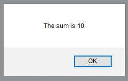

Intro to JavaScript
-------------------

As mentioned earlier, JavaScript is a general-purpose programming language. It doesn't have to be used for web development, but it does have a few advantage that make it ideally suited to the task. First, it's cross-platform, meaning that it can be executed on any computer in the world (for the most part). Second, it is simple enough and lightweight enough that it can be deployed as a package in a web browser, and indeed, every web browser worth using has a JS parser built-in. Lastly, JavaScript was in the right place at the right time. It's easier to learn that Java, and it got its start just as a new, less complex language (than Java) was needed for web-scripting.

So how do I do stuff with JS?

Variables
~~~~~~~~~

Think of a variable as a container that you put things in. Almost all programming languages have some way of storing a value for later use and JavaScript uses variables. To declare a variable, you use the :code:`var` keyword:

.. code-block:: js

    var myName;

Note, that when you create a variable, it is initially empty. To store something in it, we use the **assignment operator**, :code:`=`. 

.. code-block:: js

    myName = "Eric";

You can combine these into one line like this:

.. code-block:: js

    var myName = "Eric";

Notice that JavaScript uses semicolons to terminate all lines of code. There is some wiggle room with this rule, but it's probably a good idea to get into the habit as early as possible.

Data Types
~~~~~~~~~~

There are several basic data types that JavaScript supports. For the purposes of these tutorials, we will only use a couple, but here's a rundown of the most common ones:

+----------+-----------------------------------------------------------------------------------------+-----------------------------------------------------+
| DataType | Description                                                                             | Syntax                                              |
+==========+=========================================================================================+=====================================================+
| String   | Just plain text. Strings of characters                                                  | :code:`var myName = "Eric";`                        |
+----------+-----------------------------------------------------------------------------------------+-----------------------------------------------------+
| Number   | Numbers obey most algebraic principles                                                  | :code:`var myNum = 6;`                              |
+----------+-----------------------------------------------------------------------------------------+-----------------------------------------------------+
| Boolean  | A true/false value.                                                                     | :code:`var myBool = true;`                          |
+----------+-----------------------------------------------------------------------------------------+-----------------------------------------------------+
| Array    | A way of storing multiple values in one variable                                        | :code:`var myArray = [1, 'Eric', true, 15];`        |
+----------+-----------------------------------------------------------------------------------------+-----------------------------------------------------+
| Object   | Objects are everything else. This will be important when we start manipulating the DOM. | :code:`myDiv = document.getElementById("someDiv");` |
+----------+-----------------------------------------------------------------------------------------+-----------------------------------------------------+

We can use variables and datatypes to store just about any kind of data you can imagine. In fact, most lines of JavaScript code will include some assigning of values to variables. As already stated, we use the assignment operator, which in JavaScript is the equal sign (=), to do this. We can play around with some variable assignments. Let's look at some examples.

How to use JavaScript
~~~~~~~~~~~~~~~~~~~~~

Create a basic web page. Inside the page, create a :code:`

When you load the page, it should display an alert with the message:

In this manner, you can do computations and store values. 

Document Object Model
~~~~~~~~~~~~~~~~~~~~~

Next, let's play with how we can manipulate the elements of a web page. Built into every web browser is a hierarchy of objects that represent the currently displayed web page. These can be accessed through the use of JavaScript. How it typically works is you start at the top level and work your way down through the hierarchy. Syntactically, you use the dot operator, the period to separate the names of these "objects". For example, in your test web page, replace the JavaScript code with the following line:

.. code-block:: html

    

We start at the top which is the docuemnt, and from the document, we pick out the body and then the styles affecting the body, and then specifically select the background. We set it equal to one of the named colors in HTML5, "DarkRed". Reload the page and observe the results.

Objects
"""""""

The primary object is the :code:`document`. From there, you dig down to other objects or methods which help you find other objects. Try a few of these out:

Find things in the DOM
""""""""""""""""""""""

You can find elements in the DOM by using convenient helper methods. The most common ones are these:

+---------------------------------------+--------------------------------------+
| Object                                | Description                          |
+=======================================+======================================+
| document.getElementById(id)           | Finds an element by its id attribute |
+---------------------------------------+--------------------------------------+
| document.getElementsByTagName(name)   | Finds an element by its tag          |
+---------------------------------------+--------------------------------------+
| document.getElementsByClassName(name) | Find elements by their class name    |
+---------------------------------------+--------------------------------------+

Manipulating Elements
"""""""""""""""""""""

+-------------------------------------------+----------------------------------------------------+
| Object                                    | Description                                        |
+===========================================+====================================================+
| *element*.innerHTML = *some content*      | Changes the text inside of a set of tags           |
+-------------------------------------------+----------------------------------------------------+
| *element.attribute* = *some value*        | Changes the value of some attribute in an HTML tag |
+-------------------------------------------+----------------------------------------------------+
| *element*.setAttribute(*attribute,value*) | Changes the value of some attribute in an HTML tag |
+-------------------------------------------+----------------------------------------------------+
| *element*.style.*property*                | Changes a style element of an HTML tag.            |
+-------------------------------------------+----------------------------------------------------+

Creating Elements
"""""""""""""""""

You can even create and destroy elements already in a web page.

+-----------------------------------+-------------------------+
| Object                            | Description             |
+===================================+=========================+
| document.createElement(*element*) | Creates an element      |
+-----------------------------------+-------------------------+
| document.removeChild(*element*)   | Remove an HTML element  |
+-----------------------------------+-------------------------+
| document.appendChild(*element*)   | Add an HTML element     |
+-----------------------------------+-------------------------+
| document.replaceChild(*element*)  | Replace an HTML element |
+-----------------------------------+-------------------------+

You may have to experiment a little with these to figure out just how they work, but here are a few examples to get you started.

